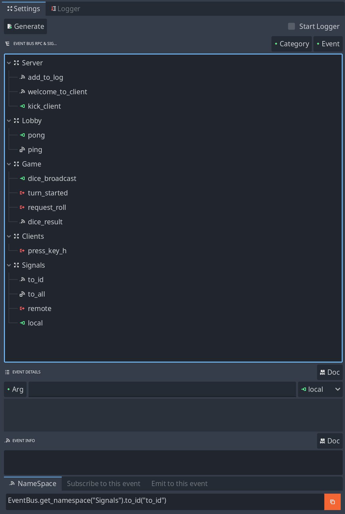

<!---->


<p align="center">
  <a href="https://auteddy.itch.io">
    
  </a>
  <a href="https://ko-fi.com/M4M51IR6VN">
    
  </a>
</p>

<p align="center">
  
  
  
  
  
</p>

<p align="center">
  <a href="https://discord.com/channels/1399270391226175518">
    
  </a>
</p>


## 🎯 EventBridge for Godot 4

Stop wiring endless signals and RPCs. Start shipping structured multiplayer code today!

<br/>

## 🚀 What is EventBridge?

EventBridge gives you a clean, scalable, and multiplayer-ready event-driven architecture for Godot 4.
Perfect for single-player and multiplayer projects where managing signals and RPCs becomes chaos.

✔ Autogenerated API – No more manual signal connections
✔ Multiplayer-Ready – Remote, to_all, to_id, local events built in
✔ Editor Integration – Visual Event Registry & API refresh in one click
✔ One Source of Truth – All events live in event_registry.json

<br/>

## ✅ Why Choose EventBridge?
- **Local & Network Events** – One API for local, server, peer-specific, or broadcast events  
- **Namespaces for Organization** – Keep events modular and maintainable  
- **Automatic Event Registry** – Define once, reuse everywhere  
- **Editor Integration** – Manage events visually with the built-in Godot panel  
- **Duplicate Protection** – No more double signal connections  
- **Persistent Caching** – Fast lookups even for large projects  
- **One-Line Cleanup** – `off_all()` removes dangling handlers instantly  

---

## 🎮 Perfect for Multiplayer
Send events:
✔ **To the server**  
✔ **To all peers**  
✔ **To a specific peer**  

**Example:**
```gdscript
var ns = EventBridge.get_namespace("Lobby")

ns.on("ping", func(msg):
    print("PING:", msg)
)

ns.remote("pong", ["Hello from client!"])
```

---

## 📦 Installation
1. Copy the **`addons/event_bridge`** folder into your Godot project  
2. Enable the plugin in **Project Settings → Plugins**  
3. Add **`event_bus.gd`** as an **Autoload Singleton**:
   - Name: `EventBridge`
   - Path: `res://addons/event_bridge/event_bus.gd`  

---

## ⚡ Quick Example Event Registry

event_registry.json is automaticly generated based on your event bus tree in the editor plugin.
event_data.tres can be copied ot a new project and you get all your events - no need to restart from scratch

```json
{
  "Test": [
    {
      "name": "ping",
      "rpc": "remote",
      "args": ["msg"]
    },
    {
      "name": "pong",
      "rpc": "remote",
      "args": ["msg"]
    }
  ]
}
```

---

## 🛠 Usage
### 1. Get a Namespace
```gdscript
var ns = EventBridge.get_namespace("Test")
```

### 2. Subscribe to Events
```gdscript
ns.on("ping", func(msg):
    print("[CLIENT] PING:", msg)
    ns.remote("pong", ["Hello from CLIENT %d" % multiplayer.get_unique_id()])
)
```

### 3. Emit Events (Server)
```gdscript
if multiplayer.is_server():
    await get_tree().create_timer(2.0).timeout
    ns.to_all("ping", ["Hello from SERVER"])
```

### ✅ Cleanup
```gdscript
func _exit_tree():
    ns.off_all()
```

---

## 🔑 Full API
| Method                  | Description                                    |
|-------------------------|-----------------------------------------------|
| `get_namespace(name)`   | Returns Namespace object for a category      |
| `on(event, callable)`   | Subscribe to an event                        |
| `emit(event, args)`     | Emit locally                                  |
| `remote(event, args)`   | Emit to server                                |
| `to_all(event, args)`   | Emit to all peers                             |
| `only_me(event, args)`  | Emit only on this client                      |
| `to_id(id, event, args)`| Emit to a specific peer                       |
| `off_all()`             | Remove all handlers in this namespace         |

---

## 📢 Example Output
```
[EventBridge] Loaded registry from: res://addons/event_bridge/event_registry.json
[EventBridge] EventBus initialized with namespaces: ["Test"]
[EventBridge] Connected handler for Test::ping
[EventBridge] Emit to all: Test::ping ["Hello from SERVER"]
[CLIENT] PING received: Hello from SERVER
[SERVER] PONG received from client: Hello back from CLIENT 123456789
```

---

## 📄 License
**EventBridge Plugin Commercial License** (included in package):  
✔ Use in unlimited projects (personal & commercial)  
❌ No redistribution or resale  

---

## 🛣 Roadmap
- [ ] GUI editor for event registry  
- [ ] Argument validation on emit  
- [ ] Type hints for callable arguments  

---

## 💬 Join the Community
[](https://discord.com/channels/1399270391226175518)

---

### ❤️ Support Development
If you enjoy using EventBridge, consider supporting my work:  
[](https://ko-fi.com/M4M51IR6VN)

---

[](https://auteddy.itch.io)

✅ FAQ Section for README
Q: Why not just use Godot signals?
Godot signals are great for local communication between nodes. EventBridge shines when you need:

Global events without wiring hundreds of connect() calls

Cross-scene communication (UI ↔ Game Logic ↔ Network)

Multiplayer-safe events with the same API as local events

Q: Won’t an event bus make my code harder to debug?
No—EventBridge improves debugging:

Logs all connected handlers and emitted events

Prevents duplicate signal connections

Provides namespaces, so you know exactly where an event belongs

Centralized registry (event_registry.json) for all global events

Q: What about race conditions and unpredictable order?
This is a valid concern for any event system. Godot signals already call listeners in an undefined order when multiple connections exist. EventBridge doesn’t make that worse—but:

It enforces structure through namespaced events

Lets you easily isolate events in logical groups

Logs calls so you can trace execution order

If you need strict deterministic order, you can always:

Use explicit calls in critical code paths

Or manage priority manually in your connected methods

Q: Can I use EventBridge for collisions, animations, or local signals?
No. Use Godot’s built-in signals for local, internal behavior. EventBridge is for:

Global notifications

UI updates

Game state changes

Multiplayer messaging

Modular game systems

Q: Is EventBridge thread-safe?
EventBridge relies on Godot signals and RPC, which follow Godot’s main-thread execution model. For heavy threaded work, emit events from the main thread only or use call_deferred().

Q: Does EventBridge introduce extra overhead?
Minimal. It’s a thin wrapper on Godot’s signal system with caching for namespaces and automatic registry binding. The performance cost is negligible compared to the clarity and scalability it provides.

✅ When NOT to Use EventBridge
EventBridge is a tool for structured, global, and networked communication, not a universal replacement for signals. Avoid using EventBridge for:

Internal object behavior
(e.g., a projectile signaling its collision or an enemy triggering its own animation)

High-frequency updates
(e.g., physics signals like body_entered that fire every frame)

Critical order-sensitive logic
If you need guaranteed call order, use direct method calls or priority-based handlers.

Instead, use Godot’s local signals or direct calls for these cases. EventBridge complements them by handling the bigger picture.
